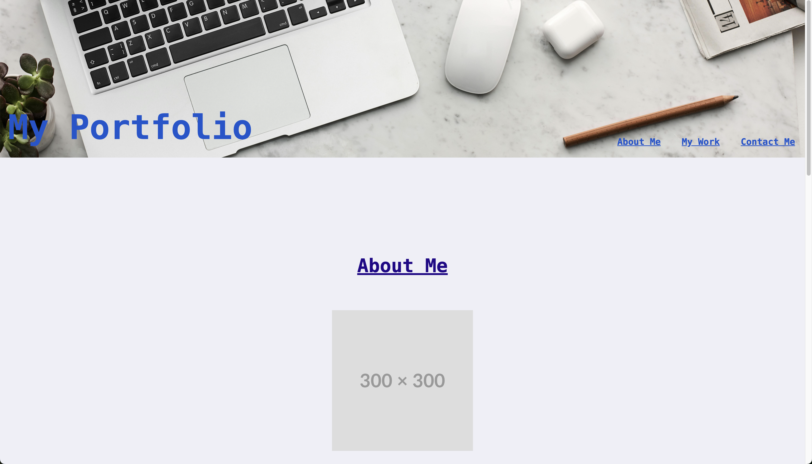

# portfolio

This is the website of my portfolio.

Some images and texts have placeholders until there are appropriate contents to replace them.

Clicking on the nav bar moves the page to the corresponding section.

Clicking on the images in the "My Work" section opens a new tab of the work webpage to the corresponding work image.

For now clicking on the "GitHub" underneath "Contact Me" opens a new tab to the profile repo in GitHub.

Here is the link to the website: https://tmw93.github.io/portfolio/

Here is a preview of the website:
